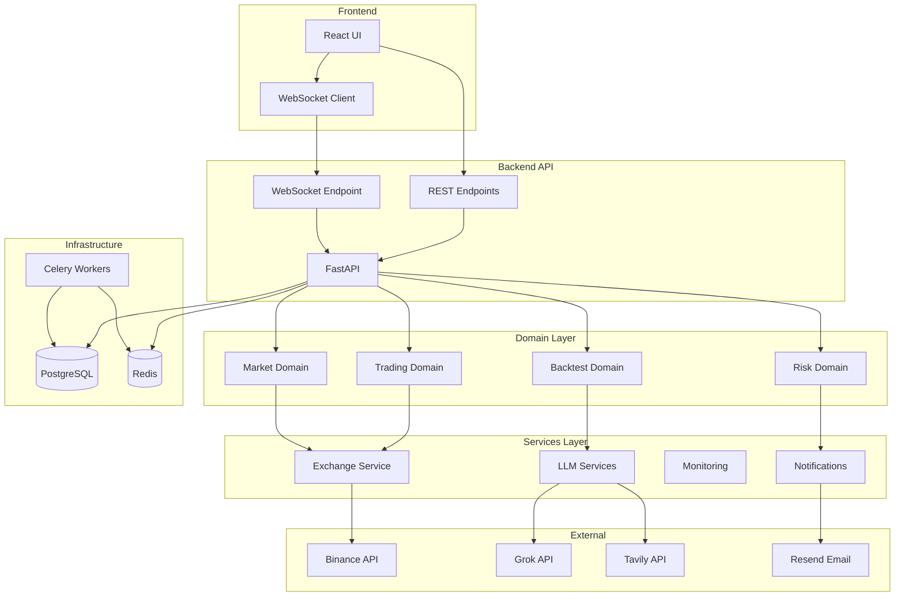

# TradeMind

Autonomous cryptocurrency trading platform powered by AI and advanced risk management.

## Overview

TradeMind is a production-ready trading bot that combines:

- **LLM-Powered Decisions**: Grok 4.1 Fast with Agent Tools for real-time market analysis
- **Advanced Risk Management**: Position sizing, daily loss limits, circuit breakers
- **Real-time Execution**: Low-latency order placement with stop-loss and take-profit
- **Backtesting**: Historical strategy validation with LLM integration
- **Observability**: Business metrics, WebSocket updates, email alerts

TradeMind uses Domain-Driven Design (DDD) with a clean architecture separating business logic from infrastructure. The system processes market data through technical indicators, enriches it with LLM analysis (including real-time web/X search), validates risk parameters, and executes trades autonomously. All operations are monitored in real-time via WebSocket and background workers handle price updates, order monitoring, and scheduled strategy execution.

## Architecture



The architecture follows a layered approach: Frontend communicates via REST and WebSocket, Backend API routes to domain logic (trading, market, risk, backtest), services handle external integrations (LLM, exchanges, monitoring), and infrastructure provides persistence (PostgreSQL) and background processing (Celery, Redis).

## Quick Start

```bash
# Clone and setup
git clone https://github.com/StephaneWamba/TradeMind
cd TradeMind

# Configure environment
cp .env.example .env
# Edit .env with your API keys

# Start services
docker-compose up -d

# Access
Frontend: http://localhost:3000
Backend API: http://localhost:5000
API Docs: http://localhost:5000/docs
```

## Features

| Feature                | Description                                                                       |
| ---------------------- | --------------------------------------------------------------------------------- |
| **LLM Trading**        | Grok 4.1 Fast analyzes market data, news, and sentiment to make trading decisions |
| **Multi-Exchange**     | Binance support with adapter pattern for easy expansion                           |
| **Risk Management**    | Fixed, Kelly, and ATR-based position sizing with daily loss limits                |
| **Backtesting**        | Test strategies on historical data with LLM-powered decisions                     |
| **Real-time Updates**  | WebSocket streams for prices, positions, trades, and portfolio                    |
| **Autonomous Trading** | Scheduled execution every 15 minutes via Celery                                   |
| **Email Alerts**       | Resend integration for critical events and failures                               |

## Documentation

- [Setup Guide](docs/SETUP.md) - Installation and configuration
- [Architecture](docs/ARCHITECTURE.md) - System design and structure
- [API Reference](docs/API.md) - Endpoint documentation
- [Trading Guide](docs/TRADING.md) - How trading works
- [Development](docs/DEVELOPMENT.md) - Developer guide

## Tech Stack

**Backend:**

- FastAPI (async Python)
- PostgreSQL (async via asyncpg)
- Redis (caching & Celery broker)
- Celery (background tasks)
- Grok 4.1 Fast (LLM)
- Tavily (web/X search)

**Frontend:**

- React + TypeScript
- Tailwind CSS
- WebSocket (real-time updates)
- Lightweight Charts

## Project Structure

```
TradeMind/
├── backend/          # FastAPI application
│   ├── src/app/
│   │   ├── domain/   # Business logic (trading, market, risk, backtest)
│   │   ├── services/ # Application services (LLM, exchange, monitoring)
│   │   ├── api/      # REST API endpoints
│   │   ├── core/     # Infrastructure (DB, Redis, WebSocket)
│   │   └── workers/  # Celery tasks
├── frontend/         # React application
└── docs/             # Documentation
```

## License

Free under MIT License
