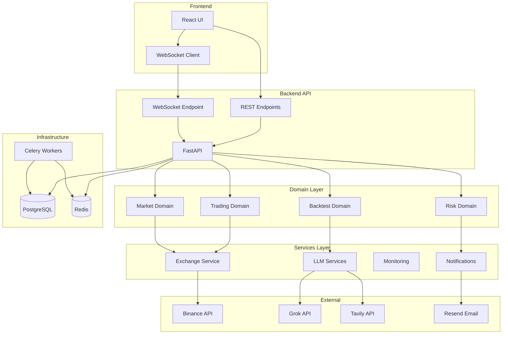
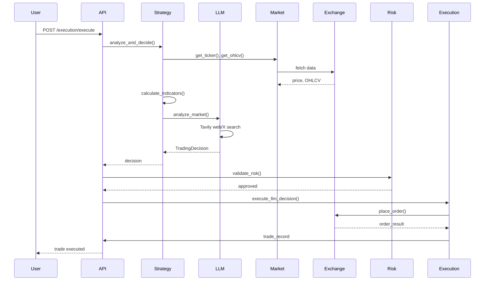
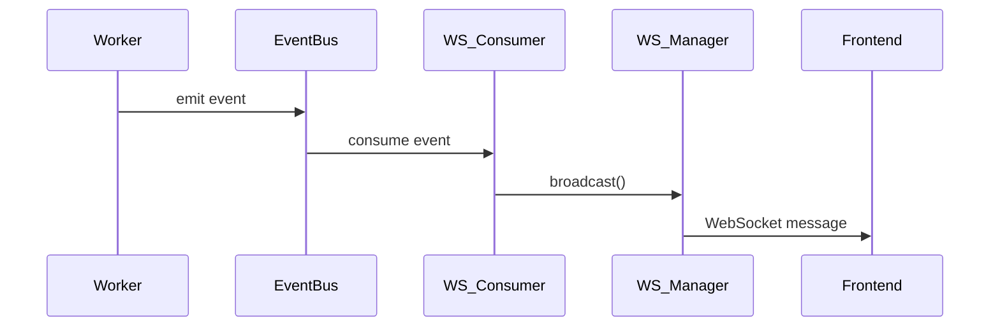

# Architecture

TradeMind follows Domain-Driven Design (DDD) principles with clear separation between business logic and infrastructure.

## System Architecture

The system is organized in layers: Frontend communicates via REST and WebSocket, Backend API routes to domain logic, services handle external integrations, and infrastructure provides persistence and background processing.



The architecture separates concerns: domain logic is pure and testable, services orchestrate and integrate, and infrastructure handles persistence and messaging.

## Domain Structure

### Domain Layer (`app/domain/`)

Pure business logic, no infrastructure dependencies:

| Domain       | Purpose              | Key Components                                  |
| ------------ | -------------------- | ----------------------------------------------- |
| **trading**  | Position management  | `PositionService`                               |
| **market**   | Market analysis      | `calculate_indicators()`, `OrderBookService`    |
| **risk**     | Risk management      | `RiskManagementService`, `PortfolioHeatService` |
| **backtest** | Strategy backtesting | `BacktestService`                               |

### Services Layer (`app/services/`)

Application services that coordinate domain logic:

| Service          | Purpose                | Location                 |
| ---------------- | ---------------------- | ------------------------ |
| **LLM**          | AI/ML services         | `services/llm/`          |
| **Exchange**     | Exchange integration   | `services/exchange/`     |
| **Monitoring**   | System monitoring      | `services/monitoring/`   |
| **Notification** | Alerts & notifications | `services/notification/` |

## Data Flow

### Trading Decision Flow

When a user triggers a trade execution, the system collects market data, calculates indicators, analyzes with LLM (including real-time web/X search), validates risk, and executes the order. Each step is logged for observability.



### Real-time Updates Flow

Background workers emit events to Redis event bus. A WebSocket consumer picks up events and broadcasts to connected clients, enabling real-time UI updates without polling.



## Component Details

### Exchange Service Architecture

Exchange operations are protected by resilience patterns: circuit breaker prevents cascading failures, rate limiter respects API limits, and retry logic handles transient errors. The adapter pattern allows easy addition of new exchanges.

```mermaid
graph LR
    ExchangeService[ExchangeService]
    BaseAdapter[BaseExchangeClient]
    BinanceAdapter[BinanceClient]
    CircuitBreaker[Circuit Breaker]
    RateLimiter[Rate Limiter]
    Retry[Retry Logic]

    ExchangeService --> BaseAdapter
    BaseAdapter <|-- BinanceAdapter
    ExchangeService --> CircuitBreaker
    ExchangeService --> RateLimiter
    ExchangeService --> Retry
```

### Risk Management Layers

| Layer               | Component               | Responsibility                            |
| ------------------- | ----------------------- | ----------------------------------------- |
| **Position Sizing** | `RiskManagementService` | Calculate position size (Fixed/Kelly/ATR) |
| **Daily Limits**    | `RiskManagementService` | Enforce daily loss limits                 |
| **Circuit Breaker** | `RiskManagementService` | Pause trading on excessive losses         |
| **Portfolio Heat**  | `PortfolioHeatService`  | Track total risk exposure                 |

## Database Schema

### Core Models

| Model                | Purpose                  | Key Fields                                            |
| -------------------- | ------------------------ | ----------------------------------------------------- |
| `ExchangeConnection` | Exchange API credentials | `api_key_encrypted`, `is_testnet`                     |
| `Strategy`           | Trading strategy config  | `name`, `is_active`, `status`                         |
| `Position`           | Open positions           | `entry_price`, `quantity`, `unrealized_pnl`           |
| `Trade`              | Executed trades          | `entry_price`, `exit_price`, `pnl`                    |
| `Order`              | Order records            | `status`, `order_type`, `exchange_order_id`           |
| `Backtest`           | Backtest results         | `status`, `total_pnl`, `win_rate`                     |
| `RiskConfig`         | Risk settings            | `max_position_size_percent`, `max_daily_loss_percent` |

## Resilience Patterns

| Pattern                | Implementation            | Purpose                    |
| ---------------------- | ------------------------- | -------------------------- |
| **Circuit Breaker**    | `core/circuit_breaker.py` | Prevent cascading failures |
| **Retry with Backoff** | `core/retry.py`           | Handle transient failures  |
| **Rate Limiting**      | `core/rate_limiter.py`    | Respect API rate limits    |
| **Connection Pooling** | `core/database.py`        | Optimize DB connections    |

## Background Processing

### Celery Tasks

| Task                  | Schedule       | Purpose                   |
| --------------------- | -------------- | ------------------------- |
| `autonomous_trading`  | Every 15 min   | Execute active strategies |
| `update_prices_task`  | Per connection | Update position prices    |
| `monitor_orders_task` | Every 30s      | Check order status        |
| `run_backtest`        | On-demand      | Run backtests             |

## Security

- **Credential Encryption**: API keys encrypted at rest
- **Session Management**: AsyncSession with proper cleanup
- **CORS**: Configured for frontend origins
- **Input Validation**: Pydantic models for all inputs
