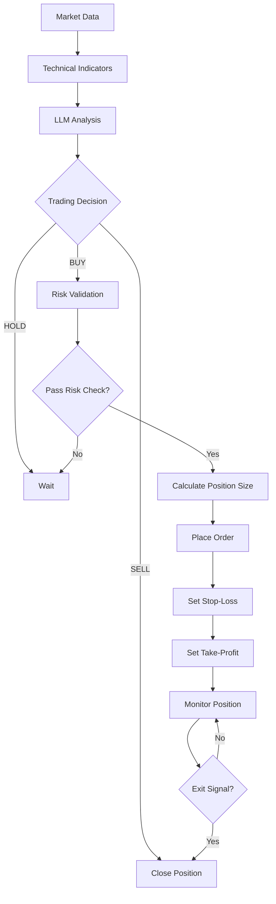
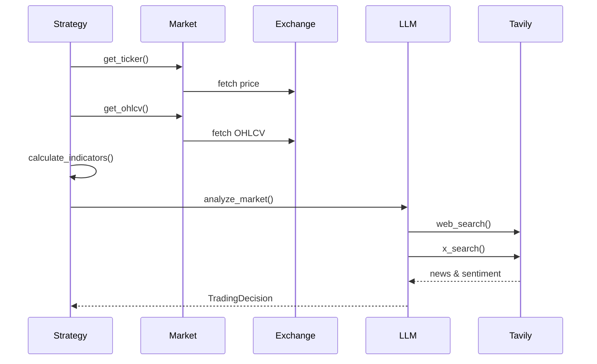

# Trading Guide

## Trading Workflow

The trading process starts with market data collection, then technical analysis, followed by LLM-powered decision making. Risk validation ensures safety before execution. Positions are monitored until exit signals trigger closure.



## LLM Decision Process

The LLM decision process combines technical indicators with real-time market intelligence from web search and X/Twitter sentiment analysis.

### 1. Data Collection

The system fetches current prices, historical OHLCV data for multiple timeframes (1h, 4h, 1d), calculates technical indicators, and enriches context with news and sentiment via Tavily Agent Tools.



The LLM uses Grok Agent Tools to search the web and X/Twitter in real-time, then returns a structured decision with action, confidence, position sizing, and risk management parameters.

### 2. Decision Structure

The LLM returns a structured `TradingDecision`:

| Field                   | Type              | Description                    |
| ----------------------- | ----------------- | ------------------------------ |
| `action`                | `BUY\|SELL\|HOLD` | Trading action                 |
| `confidence`            | `float`           | Confidence (0.0-1.0)           |
| `position_size_percent` | `float`           | Position size (% of portfolio) |
| `stop_loss_percent`     | `float`           | Stop-loss percentage           |
| `take_profit_percent`   | `float`           | Take-profit percentage         |
| `reasoning`             | `string`          | LLM reasoning                  |
| `risk_factors`          | `list`            | Identified risks               |

### 3. Risk Validation

Before execution, the system validates:

1. **Daily Loss Limit**: Check if strategy exceeded max daily loss
2. **Circuit Breaker**: Check if strategy is paused
3. **Portfolio Heat**: Check total risk exposure
4. **Position Size**: Validate against max position size
5. **Confidence Threshold**: Minimum confidence required (default: 0.6)

If any validation fails, the trade is rejected and an alert is sent. This multi-layer protection prevents overexposure and catastrophic losses.

## Position Sizing Methods

### Fixed Sizing

Uses a fixed percentage of portfolio:

```
position_size = balance * DEFAULT_POSITION_SIZE_PERCENT (1%)
```

### Kelly Criterion

Optimal position sizing based on win rate:

```
kelly_fraction = (win_rate * win_loss_ratio - loss_rate) / win_loss_ratio
kelly_fraction = kelly_fraction * 0.25  # Fractional Kelly (25%)
position_size = balance * kelly_fraction
```

**Requirements:**

- `win_rate`: Historical win rate (0.0-1.0)
- `avg_win`: Average winning trade amount
- `avg_loss`: Average losing trade amount

### ATR-Based Sizing

Volatility-adjusted position sizing:

```
risk_amount = balance * 0.01  # Risk 1% of portfolio
stop_distance = max(stop_loss_distance, atr * 0.5)
position_size = risk_amount / (stop_distance / current_price)
```

**Requirements:**

- `atr`: Average True Range
- `current_price`: Current market price
- `stop_loss_percent`: Stop-loss percentage

Position sizing adapts to market conditions: fixed for simplicity, Kelly for optimal growth, and ATR-based for volatility-adjusted risk.

## Risk Management

### Daily Loss Limit

Tracks daily P&L per strategy:

| Limit                    | Default | Action                     |
| ------------------------ | ------- | -------------------------- |
| `MAX_DAILY_LOSS_PERCENT` | 5%      | Pause strategy if exceeded |

### Circuit Breaker

Automatically pauses strategy on:

- Excessive consecutive losses
- Large drawdown
- Manual trigger

**States:**

- `CLOSED`: Normal operation
- `OPEN`: Trading paused
- `HALF_OPEN`: Testing recovery

Circuit breakers automatically pause trading when losses exceed thresholds, protecting capital during adverse conditions.

### Portfolio Heat

Total risk exposure across all positions:

```
portfolio_heat = sum(position_value * stop_loss_percent) / total_portfolio_value
```

**Alert Threshold:** 20% (configurable)

Portfolio heat tracks total risk exposure across all open positions. When heat exceeds 20%, alerts are sent to prevent over-leveraging.

## Order Types

| Type            | Description         | Use Case                |
| --------------- | ------------------- | ----------------------- |
| **Market**      | Immediate execution | Entry/exit              |
| **Limit**       | Execute at price    | Better fill             |
| **STOP_MARKET** | Trigger on price    | Stop-loss               |
| **OCO**         | One-Cancels-Other   | Stop-loss + Take-profit |

## Stop-Loss & Take-Profit

### Stop-Loss

- **ATR-Based**: `stop_price = entry_price - (atr * 2)`
- **Percentage-Based**: `stop_price = entry_price * (1 - stop_loss_percent)`
- **Trailing Stop**: Updates as price moves favorably

### Take-Profit

- **ATR-Based**: `take_profit = entry_price + (atr * 4)` (2:1 R:R)
- **Percentage-Based**: `take_profit = entry_price * (1 + take_profit_percent)`

Stop-loss and take-profit are calculated based on ATR (volatility) or fixed percentages. Trailing stops automatically adjust as price moves favorably, locking in profits while allowing for upside.

## Backtesting

Backtests use the same LLM decision process on historical data:

1. Fetch historical OHLCV data
2. Calculate indicators for each candle
3. Call LLM every 6 candles (configurable)
4. Execute decisions with position sizing
5. Track P&L and performance metrics

**Metrics Calculated:**

- Total P&L and P&L %
- Win rate
- Profit factor
- Max drawdown
- Sharpe ratio
- Average trade duration

Backtests simulate real trading by calling the LLM on historical data, ensuring strategies are tested under realistic conditions before live deployment.

## Autonomous Trading

Scheduled execution every 15 minutes:

1. Find all active strategies
2. For each strategy:
   - Check risk limits
   - Analyze market
   - Execute if conditions met
3. Update positions and portfolio

**Configuration:**

- Schedule: `beat_schedule.py`
- Task: `execute_active_strategies`
- Interval: Every 15 minutes

## Best Practices

1. **Start Small**: Use testnet and small position sizes
2. **Monitor Risk**: Check portfolio heat regularly
3. **Set Limits**: Configure daily loss limits
4. **Backtest First**: Test strategies on historical data
5. **Review Decisions**: Check LLM logs for reasoning
6. **Use Stop-Loss**: Always set stop-loss orders
7. **Diversify**: Don't risk too much on one symbol
